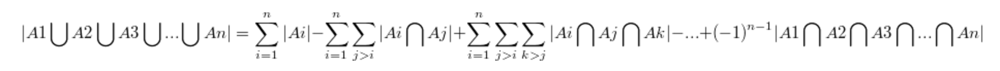
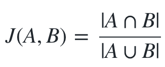
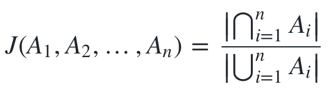

<!-- datetime: 2015-12-11 22:11:34 -->
<!-- more -->

用户数统计基本上有三种做法。

1. 使用一个Set来直接记录用户数
2. 自己实现类似BloomFilter的方法
3. HyperLogLog

#### HyperLogLog

HyperLogLog(HLL)作为比较新的一种方案，比起BloomFilter，错误可以比较稳定的维持在一个较低的水平。绝大多数情况下误差不回超过5%，平均错误在1%以内，对于超大量的用户量级维护十分友好。

Redis里原生提供对HyperLogLog的支持，官方说明12K的key可以存放2^64的uniqueid

当然，如果要保证毫无错误的话，还是直接使用Set来保存是最好。

关于HyperLogLog的文章可以参考 http://blog.codinglabs.org/articles/algorithms-for-cardinality-estimation-part-iv.html 或者自行Google

#### 容斥原理

我们会遇到这样一种情况——我们有许多的用户数据，包用户的使用的手机品牌型号，地理位置，运营商等信息。

这时我们想要计算每一天，我们在各个省市有多少用户、各个品牌上有多少用户、联通有多少用户，移动有多少用户、有多少用户使用WIFI接入我们的产品，有多少用户使用3G接入我们的产品。

甚至，我们还想知道，广州小米有多少用户？，浙江三星有多少用户？；又或者在深圳使用小米的联通用户有多少？北京使用iPhone6s的移动用户里4G的用户有多少？

看到这么多的排列组合，即使手头握着HyperLogLog这样的神器，也开始不淡定了呢。

于是我们想到，能不能记录下每天广州的用户数HLL以及使用iPhone的用户数的HLL，然后将两个HLL做一个Intersection，就可以近似的算出每天广州的iPhone用户有多少？

想法是挺好的，但是HyperLogLog并不能支持简单的Intersection。单纯的使用异或运算运算是无法得出正确结果的。

幸运的是，HyperLogLog作为一种数据集合，是可以直接使用集合公式进行运算的。

以下使用Redis自带的HyperLogLog为基础进行计算，Redis中PFCOUNT可以合并计算多个HLL的结果，结果相当于计算多个HLL集合的并集。

即：`PFCOUNT k1 k2 k3 == k1 ∪ k2 ∪ k3`

根据集合运算中的容斥原理（请参见高中课本或https://en.wikipedia.org/wiki/Inclusion%E2%80%93exclusion_principle），集合A跟B的交集等于A跟B的和减去A跟B的交集。

即：`|A∪B|=|A|+|B|-|A∩B|`，所以可得：`|A∩B|=|A|+|B|-|A∪B|`。

即假设，集合A有10个元素，集合B有6个元素，A与B的并集有12个元素，那么可以算得A与B的交集必然有10+6-12=4个元素。

回到Redis，根据上面所列公式，计算`k1∩k2`的方法为：`PFCOUNT k1 + PFCOUNT k2 - PFCOUNT k1 k2`

3个元素的情况下，`|A∪B∪C|=|A|+|B|+|C|-|A∩B|-|A∩C|-|B∩C|+|A∩B∩C|`

所以计算`k1∩k2∩k3`的方法也可以递归得出，同理更高维的情况。

n个维度：



习题 \_(•̀ω•́ 」∠)_：

``` 
求a,b,c,d,e,f六个字母的全排列中不允许出现ace和df图象的排列数。
```

#### MinHash

上面的习题做不出来的话，请看这里∠( ᐛ 」∠)＿

MinHash原本是搜索引擎用来快速估算两个网页的相似度而研究出来的一种算法，她可以用来快速计算两个集合的相似程度。

介绍见此 https://en.wikipedia.org/wiki/MinHash

MinHash会对数据进行Hash并得到一个较为简短的摘要，对内存开销十分友好，这点与HLL类似。

MinHash度量结果叫做Jaccard similarity，记做`J`，其中有公式：



多维的情况下，可以表示为：



由上面两个公式可以看到，求交集的方法已经呼之欲出。

#### 最后

值得注意的是，因为HyperLogLog本身并不是100%无差统计，每个HLL的数据集里都可能会多多少少有一些误差，在做容斥运算的时候会导致这些误差增大。最坏的情况下，误差可能会达到30%多，且在做减法运算时，可能会出现负数的情况。

#### 参考：

http://tech.adroll.com/blog/data/2013/07/10/hll-minhash.html

http://research.neustar.biz/2012/12/17/hll-intersections-2/
